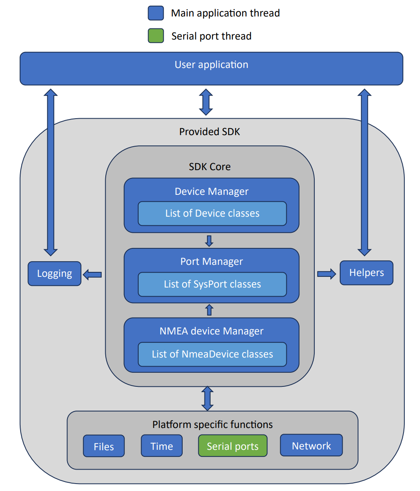

# Impact Subsea SDK

 Read this page first to understand the basics of the SDK!

## Introduction
The Software Development Kit (SDK) is an open source software library that simplifies the development of an application intended to communicate with Impact Subsea products. The SDK provides the following: 
-	Ability to open, close and configure the computer’s serial and network ports.
- Interact with Serial over LAN (SOL) or (network to serial adapters). 
-	Automatically discover Impact Subsea devices connected to the computer.
-	Automatically detect NMEA devices, such as a GPS connected to the computer serial ports.
-	Dynamically creates objects to manage each discovered device and allow the user’s application to interact with the device via this object.
- Log all connected Impact Subsea devices and GPS data to a log file.
- Play back of log files.

The SDK is written in C++17 and cmake is used for compiling the project. It has been written in a cross-platform way with embedded credit card computers in mind, such as the Raspberry Pi and Beagle Bone type systems. The minimum hardware specification is: 
-	100Mhz 32-bit processor with FPU (Floating Point Unit)
-	32MB RAM

 This SDK will detect all firmware versions of Impact Subsea devices but will only work with firmware versions 3.x.x and above.

*******************

## Architecture
The SDK is based on the Observer pattern. Data is generally acquired by subscribing to the provided signals, allowing for event based programming. All calls into the SDK are non-blocking.

The {@link IslSdk::Signals Signals} connect to {@link IslSdk::Slot Slot} classes which hold the function pointer of the user’s function. The use of a slot class means if the users object is destructed then the slot class is also destructed and will unsubscribe from the event. This avoids dangling member function pointers. For efficiency the Signal Slot system is not thread safe.

To use the SDK first make an instance of {@link IslSdk::Sdk Sdk}. Then subscribe to the {@link IslSdk::SysPortMgr::onNew sdk.ports.onNew}, {@link IslSdk::DeviceMgr::onNew sdk.device.onNew} and optionally {@link IslSdk::NmeaDeviceMgr::onNew sdk.nmeaDevices.onNew} signals using the {@link IslSdk::Signal::connect connect} function.

Now call {@link IslSdk::Sdk::run sdk.run()} repeatedly from a timer or a loop at a sufficient rate, every 40 milliseconds is sufficient. This runs all the sdk tasks such as checking for new ports and processing the devices protocol stack. All signals are fired from this call so make sure it’s called from the thread you want the subscribed function to run in. 
See the example app for a working example of SDK usage.

### Device Manager
The {@link IslSdk::DeviceMgr Device Manager} class maintains a list of devices by holding a shared pointer to the base class {@link IslSdk::Device Device}. All Impact Subsea products inherit from this class. It provides the basic functionality and communication services. 

#### Device comms
Since firmware version 3.x.x devices now use a more complicated [HDLC](https://en.wikipedia.org/wiki/High-Level_Data_Link_Control) style of communication. Normal response mode (NRM) for half duplex systems like RS485, single and multidrop, and Asynchronous response mode (ARM) for full duplex links like RS232 and ethernet are supported. The protocol guarantees delivery of data by the detection and retransmission of packets. Pre firmware 3.x.x versions devices used a simple stop and wait type protocol which limited the bandwidth as devices were polled by the host. This new HDLC style of communication is a best effort service, once both host and device have negotiated a connection any side is free to send data when in ARM mode.

When devices communicate over a network connection the HDLC frames are placed into the UDP payload as UDP offers a packet delivery service unlike a TCP stream.
When devices communicate over RS232 or RS485 the HDLC packets are [COBS](https://en.wikipedia.org/wiki/Consistent_Overhead_Byte_Stuffing) encoded to provide frame delimitation. 

### Port Manager
The {@link IslSdk::SysPortMgr Port Manager} class maintains a list of ports by holding a shared pointer to the base class {@link IslSdk::SysPort SysPort}. This generalised base class offers a common interface for device to communicate through. It is inherited by every type of host communication port the SDK supports. E.g. {@link IslSdk::UartPort UartPort} for the serial ports, {@link IslSdk::NetPort NetPort} for network sockets and {@link IslSdk::SolPort SolPort} for Serial Over LAN adapters.

*******************
## How to build
The SDK and example app requires two #define's to be defined these are: 
#define `SYSTEM_32BIT` or `SYSTEM_64BIT` depending if 32 or 64 bit builds are required. 
#define `OS_WINDOWS` or `OS_UNIX` depending on the platform. 

#define `DEBUG_ON` can also be define if the SDK is to output debug messages.

The `CMakeLists.txt` automatically defines these definitions depending on the platform and release / debug builds. However, the `SYSTEM_32BIT` or `SYSTEM_64BIT` definitions have to be manually selected by modifying the `CMakeLists.txt` file. Add `set(X32_BIT TRUE)` for 32 bit builds.

### Using Microsoft Visual Studios
1. Open Microsoft Visual Studios and click continue without code.
2. Open the `CmakeLists.txt` file from the menu `File->Open->CMake..`
3. Select the startup object from the dropdown green compile and run button.
4. Click the Compile / Run button.

### Building just the SDK into a static library using cmake
1. Navigate to the islSdk folder and create a new folder named build in which to place the build files. Note the folder name is not important.
2. Open a terminal and navigate to the newly created build folder.
3. At the terminal command line type: `cmake -DCMAKE_BUILD_TYPE=Debug ..` Note the space and 2 dots at the end as the CMakeLists.txt file is up a directory. `cmake -DCMAKE_BUILD_TYPE=Release ..` is another option and will turn off the SDK generated debug messages.
4. At the terminal command line type: `make`. If using windows type `cmake --build .`

The SDK source code will compile to a static library placed in the build/lib folder.

### Building the Example App and SDK to produce an executable using cmake
1. Navigate to the folder containing the sdkExample folder, islSdk folder and CMakeLists.txt file. Create a new folder named build in which to place the build files. Note the folder name is not important.
2. Open a terminal and navigate to the newly created build folder.
3. At the terminal command line type: `cmake -DCMAKE_BUILD_TYPE=Debug ..` Note the space and 2 dots at the end as the CMakeLists.txt file is up a directory. `cmake -DCMAKE_BUILD_TYPE=Release ..` is another option and will turn off the SDK generated debug messages.
4. At the terminal command line type: `make`. If using windows type `cmake --build .`
5. Run the executable by typing `bin/sdkExample` into the terminal.
